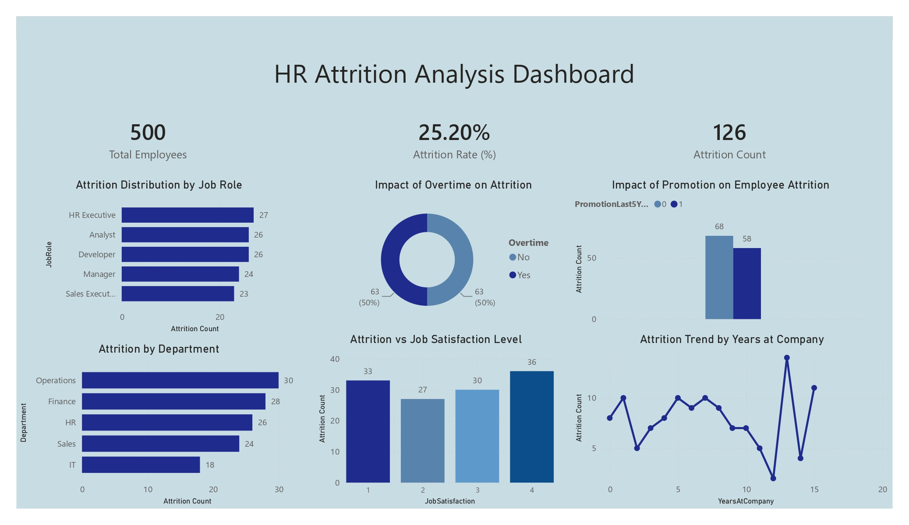

# HR Attrition Analysis Dashboard

## Project Overview

Employee attrition is one of the most critical challenges faced by organizations. High turnover rates can lead to increased recruitment costs, loss of productivity, and reduced employee morale.

This Power BI dashboard was developed to analyze employee attrition patterns and identify key factors influencing workforce retention. The dashboard provides actionable insights into employee turnover across departments, job roles, satisfaction levels, overtime status, promotions, and tenure.

The goal of this project is to help HR professionals and business leaders make data-driven decisions to improve employee retention strategies.

---

## Dashboard Preview



---

## Business Problem

Organizations often struggle to understand:

- Which departments experience the highest employee turnover
- Whether overtime contributes to attrition
- How employee satisfaction impacts retention
- The effect of promotions on employee turnover
- Attrition trends across employee tenure

This dashboard addresses these challenges by transforming HR data into meaningful visual insights.

---

## Key Performance Indicators (KPIs)

| Metric | Value |
|----------|----------|
| Total Employees | 500 |
| Attrition Count | 126 |
| Attrition Rate | 25.20% |

---

## Dashboard Insights

### 1. Attrition Distribution by Job Role

- HR Executives show the highest attrition count.
- Analysts and Developers also experience significant turnover.
- Identifies roles that may require targeted retention strategies.

### 2. Attrition by Department

- Operations department has the highest employee attrition.
- Finance and HR departments also show elevated turnover.
- IT department records the lowest attrition count.

### 3. Impact of Overtime on Attrition

- Employees working overtime account for a significant portion of attrition.
- Indicates that workload and work-life balance may influence employee decisions to leave.

### 4. Impact of Promotion on Employee Attrition

- Employees with and without recent promotions exhibit different attrition patterns.
- Helps evaluate the effectiveness of career growth opportunities within the organization.

### 5. Attrition vs Job Satisfaction Level

- Attrition varies across satisfaction levels.
- Understanding employee satisfaction can help improve retention initiatives.

### 6. Attrition Trend by Years at Company

- Employee turnover fluctuates based on tenure.
- Certain experience ranges demonstrate higher attrition risk than others.

---

## Tools & Technologies Used

### Data Visualization
- Power BI Desktop

### Data Preparation
- Power Query

### Data Modeling
- Relationships
- Star Schema Concepts

### Analytics
- DAX (Data Analysis Expressions)

### Reporting
- Interactive Dashboard Design
- KPI Cards
- Bar Charts
- Donut Charts
- Line Charts

---

## Dataset Information

The dataset contains employee-related information including:

- Employee ID
- Department
- Job Role
- Job Satisfaction
- Overtime Status
- Promotion History
- Years at Company
- Attrition Status

The data was cleaned and transformed before building the dashboard.

---

## DAX Measures Used

### Total Employees

```DAX
Total Employees = COUNT(Employee[EmployeeID])
```

### Attrition Count

```DAX
Attrition Count =
CALCULATE(
    COUNT(Employee[EmployeeID]),
    Employee[Attrition] = "Yes"
)
```

### Attrition Rate

```DAX
Attrition Rate =
DIVIDE(
    [Attrition Count],
    [Total Employees]
) * 100
```

---

## Key Findings

- Overall attrition rate is 25.20%.
- Operations department experiences the highest turnover.
- Overtime appears to have a strong relationship with attrition.
- Employee satisfaction levels influence retention outcomes.
- Attrition patterns vary significantly across job roles and tenure groups.

---

## Business Recommendations

### Improve Work-Life Balance
Monitor overtime workloads and introduce flexible work policies.

### Strengthen Career Development
Provide promotion opportunities and structured growth plans.

### Employee Engagement Programs
Conduct regular feedback surveys and engagement initiatives.

### Focus on High-Risk Departments
Develop targeted retention strategies for departments with elevated turnover.

### Monitor Satisfaction Levels
Implement programs to improve employee satisfaction and workplace culture.

---

## Project Outcomes

This dashboard enables organizations to:

✔ Track workforce attrition metrics

✔ Identify turnover patterns

✔ Understand retention drivers

✔ Support HR decision-making

✔ Develop proactive retention strategies

---

## Author

**Yashwanth Katuru**

Aspiring Data Analyst | Power BI Developer | SQL | Python | Data Visualization
